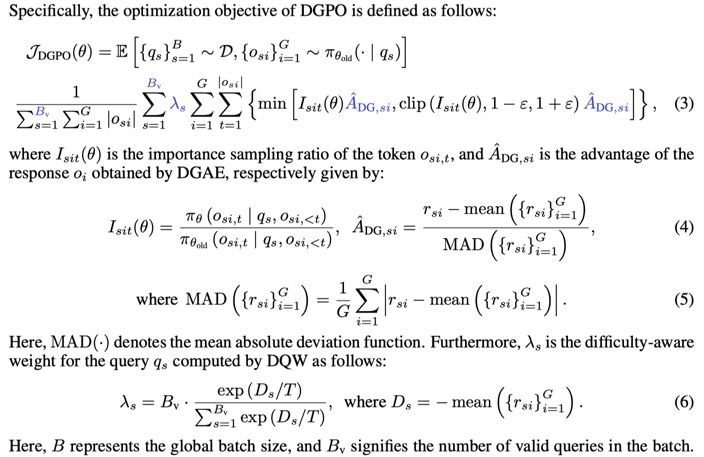

<h1 align="center" style="margin-top: 10px;">Harder Is Better: Boosting Mathematical Reasoning via Difficulty-Aware GRPO and Multi-Aspect Question Reformulation</h1>

<p align="center">
  <a href="https://yanqidai.github.io/">Yanqi Dai</a><sup>1,2</sup>,
  Yuxiang Ji<sup>3</sup>,
  Xiao Zhang<sup>4</sup>,
  Yong Wang<sup>2†</sup>,
  Guanhua Chen<sup>3</sup>,
  Xiangxiang Chu<sup>2</sup>,
  Zhiwu Lu<sup>1</sup>
  <br>
  <sup>1</sup>Gaoling School of Artificial Intelligence, Renmin University of China &nbsp;&nbsp;
  <sup>2</sup>AMAP, Alibaba Group &nbsp;&nbsp;
  <sup>3</sup>Xiamen University &nbsp;&nbsp;
  <sup>4</sup>Dalian University of Technology
  <br>
  <sup>†</sup>Project lead. &nbsp;&nbsp;&nbsp;
</p>

<div align="center"> 

[](https://arxiv.org/abs/2601.20614)
[](https://huggingface.co/papers/2601.20614)
[](https://huggingface.co/datasets/YanqiDai/MathForge_MATH-augmented)

</div>

## News

- [Jan 31, 2026]: 🛠️ Code and augmented data are released.
- [Jan 29, 2026]: 🔥 Our paper is published on arXiv and HuggingFace, and becomes **#1 Paper of the day** in HuggingFace Daily Papers.
- [Jan 26, 2026]: 🎉 Our paper is accepted by **ICLR 2026**.

## Contents

- [News](#news)
- [Contents](#contents)
- [Introduction](#introduction)
  - [Difficulty-Aware Group Policy Optimization (DGPO)](#difficulty-aware-group-policy-optimization-dgpo)
  - [Multi-Aspect Question Reformulation (MQR)](#multi-aspect-question-reformulation-mqr)
  - [Main Results](#main-results)
- [Datasets](#datasets)
- [Installation](#installation)
- [Training](#training)
- [Evaluation](#evaluation)
- [Acknowledgement](#acknowledgement)
- [Citation](#citation)

## Introduction

We propose a two-dual MathForge framework to improve mathematical reasoning by targeting harder questions from both perspectives, which comprises a Difficulty-Aware Group Policy Optimization (DGPO) algorithm and a Multi-Aspect Question Reformulation (MQR) strategy. Overall, MathForge forms a synergistic loop: MQR expands the data frontier, and DGPO effectively learns from the augmented data.

### Difficulty-Aware Group Policy Optimization (DGPO)

Algorithmically, widely used Group Relative Policy Optimization (GRPO) suffers from an implicit imbalance where the magnitude of policy updates is lower for harder questions.
DGPO first rectifies the implicit imbalance in GRPO via difficulty-balanced group advantage estimation (DGAE), and further prioritizes harder questions by difficulty-aware question-level weighting (DQW).

<p align="center">
  
</p>

### Multi-Aspect Question Reformulation (MQR)

Data-wise, augmentation approaches primarily rephrase questions to enhance diversity without systematically increasing intrinsic difficulty.
MQR reformulates questions across multiple aspects to increase difficulty while maintaining the original gold answer. 
The core instructions for these strategies are as follows:

<p align="center">
  
</p>

<!-- - **Background:** Add a story background that is not related to the core mathematical content of the given question, but seems to be related to the question. If the given question already has such a background, change it to a new, complexer background.
- **Term:** Invent a new, abstract mathematical term to define a concept that is central to the given question, and restate the entire question using this term.
- **Sub-Problem:** Convert a key numerical condition of the given question which have a definite value into an independent sub-problem. The sub-problem may belong to any branch of mathematics (e.g., algebra, geometry, number theory, combinatorics). -->

### Main Results

The main comparative results on the MATH dataset using Qwen2.5-Math-7B are presented in the following table, demonstrating significant effectiveness of DGPO, MQR, and the overall MathForge framework.

| Methods     | AIME24 | AIME25 | AMC23 | MATH500 | Minerva | Olympiad | Avg. / $Δ_\text{GRPO}$ |
|-------------|:--------:|:--------:|:-------:|:---------:|:---------:|:----------:|---------------|
| Base Model  | 12.19  | 4.79   | 35.23 | 48.60   | 15.07   | 16.33    | 22.04         |
| GRPO        | 20.94  | 8.44   | 58.98 | 72.20   | 27.76   | 37.33    | 37.61         |
| Dr.GRPO     | 21.04  | 8.23   | 58.59 | 72.05   | 28.58   | 35.89    | 37.40 (−0.21) |
| GPG         | 21.98  | 9.06   | 59.61 | 72.05   | 27.21   | 37.67    | 37.93 (+0.32) |
| DAPO        | 21.25  | 8.75   | 58.20 | 72.70   | 29.50   | 37.22    | 37.94 (+0.33) |
| GSPO        | 19.38  | 8.33   | <u>60.16</u> | 73.00   | 28.12   | 37.26    | 37.71 (+0.10) |
| GRPO-AD     | 21.56  | 9.48   | 59.06 | 73.25   | 29.14   | 37.07    | 38.26 (+0.65) |
| DGPO        | 23.85  | 10.21  | **61.02** | 74.25   | 31.07   | 38.33    | 39.79 (+2.18) |
| MQR         | **25.00** | 11.77  | 59.38 | <u>77.85</u> | <u>31.43</u> | <u>40.81</u> | <u>41.04 (+3.43)</u> |
| MathForge   | <u>24.58</u> | **12.60** | 59.84 | **79.95** | **33.36** | **42.67** | **42.17 (+4.56)** |

## Datasets

You can find the datasets constructed by this work in the following links:

- **[MathForge_MATH-augmented](https://huggingface.co/datasets/YanqiDai/MathForge_MATH-augmented)**: We augmented the training questions of the [MATH](https://huggingface.co/datasets/DigitalLearningGmbH/MATH-lighteval) dataset using our proposed MQR strategy, resulting in a dataset that is 4 times as large as the original training set.
- **[MathForge_GEOQA-R1V-revised](https://huggingface.co/datasets/YanqiDai/MathForge_GEOQA-R1V-revised)**: We revised the [GEOQA_R1V_Train_8K](https://huggingface.co/datasets/leonardPKU/GEOQA_R1V_Train_8K) dataset by correcting unit errors in the original gold answers, reformatting the data, and randomly splitting it into training and test sets.
- **[YanqiDai/MathForge_NuminaMath-CoT-sample80k](https://huggingface.co/datasets/YanqiDai/MathForge_NuminaMath-CoT-sample80k)**: We randomly sampled 80k data from the [NuminaMath-CoT](https://huggingface.co/datasets/numina/NuminaMath-CoT) dataset for supervised fine-tuning of DeepSeek-Math-7B.

## Installation

Create a conda environment with the required dependencies:

```bash
conda create -n mathforge python=3.10
conda activate mathforge
pip install torch==2.6.0 torchvision==0.21.0 torchaudio==2.6.0  
pip install vllm==0.8.5.post1
pip install flash-attn==2.8.2 --no-build-isolation
```

Clone this repository and install open-r1 and trl from our modified branches:

```bash
git clone https://github.com/AMAP-ML/MathForge.git
# install open-r1
cd MathForge
pip install -e ".[dev]"
# install trl==0.20.0
cd trl-0.20.0
pip install -e .
```

## Training

Please refer to the scripts in the `scripts_mathforge` folder for training various models using GRPO, DGPO, or MathForge (DGPO + MQR).
To quickly start training, you can use the following command as an example:

```bash
bash scripts_mathforge/Qwen2.5-7B_MATH/run_mathforge.sh
```

## Evaluation

For mathematical reasoning evaluation, we recommend using the [Lighteval](https://github.com/huggingface/lighteval) toolkit.
You can use the following command to evaluate a trained model on multiple mathematical benchmarks, including AIME24, AIME25, AMC23, MATH500, Minerva, and Olympiad:

```bash
CUDA_VISIBLE_DEVICES=0 bash eval/evaluate_math.sh <model_path>
```

For geographical reasoning evaluation on the GEOQA dataset, you can use the following command:

```bash
CUDA_VISIBLE_DEVICES=0 bash eval/evaluate_geoqa.sh <model_path>
```

## Acknowledgement

This work was built upon several open-source projects, including [Open-R1](https://github.com/huggingface/open-r1), [TRL](https://github.com/huggingface/trl), [R1-V](https://github.com/StarsfieldAI/R1-V), [MATH](https://github.com/hendrycks/math), and [Lighteval](https://github.com/huggingface/lighteval).
We express our gratitude to these projects.

## Citation

If you find MathForge useful for your research and applications, please cite using this BibTeX:

```bibtex
@article{dai2026harder,
    title={Harder is better: Boosting mathematical reasoning via difficulty-aware grpo and multi-aspect question reformulation}, 
    author={Dai, Yanqi and Ji, Yuxiang and Zhang, Xiao and Wang, Yong and Chu, Xiangxiang and Lu, Zhiwu},
    journal={arXiv preprint arXiv:2601.20614},
    year={2026}
}
```

